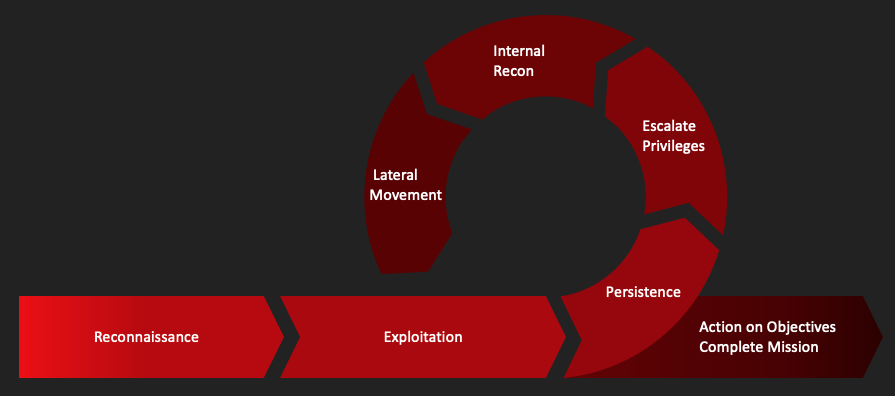

# Red Team Toolbox

This Repo contains a suite of bash and shell scripts that cover the phases of a Red Team Attack Lifecycle. It is structured according to the phases of this Attack Lifecycle. Each phase contains an executable script and partly additional information about the respective phase.

---
**No Installation. No Agents.** 

---

## Usage

To use this repo, go to the individual phases (directories) and read the instructions there.

## Composition

The script suite covers the following phases:

1. Reconnaissance
1. Exploitation
1. Persistence
1. Escalate Privileges
1. Internal Recon
1. Lateral Movement
1. Action on Objectives

## Supported Platforms

- Kali Linux (tested on version 2022.1)
